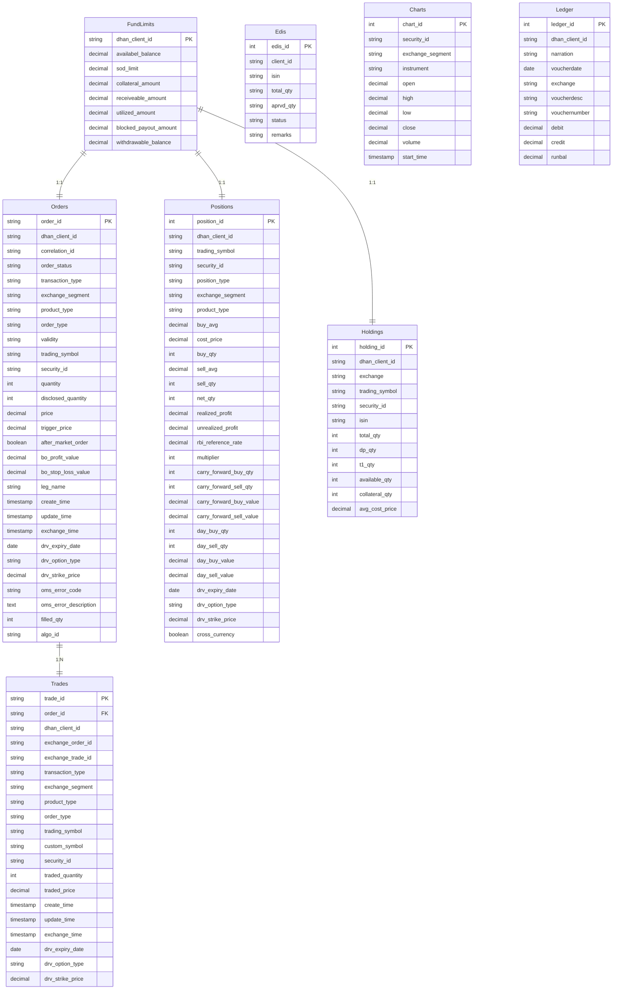

# Database Schema and Relationships

This document provides a comprehensive overview of the database schema used by the Dhan API. Understanding the schema is crucial for developers who need to query data directly, build integrations, or gain a deeper understanding of the application's data flow.

**Target Audience:** Backend Developers, Database Administrators

## Database Schema

The Dhan API's backend likely utilizes a relational database to store and manage data. While the exact database system (e.g., PostgreSQL, MySQL) is not specified in the OpenAPI specification, the schema can be inferred from the API's data models and the relationships between them.

### Data Models

The OpenAPI specification defines various data models (schemas) that represent the structure of data exchanged through the API. These models often correspond directly to tables in the database.  Here's a breakdown of some key data models and their potential database table representations:

*   **Order:** Represents an order placed by a user.
*   **Trade:** Represents a trade executed for an order.
*   **Position:** Represents a user's open position in a security.
*   **Holding:** Represents a user's holdings of a security.
*   **FundLimit:** Represents a user's fund limits and balances.
*   **Edis:** Represents Electronic Delivery Instruction Slip (EDIS) related data.
*   **Charts:** Represents OHLCV (Open, High, Low, Close, Volume) chart data.
*   **Ledger:** Represents a user's trading account ledger.

### Table Schemas

Below are example table schemas based on the OpenAPI specification's data models.  These are illustrative and may not perfectly reflect the actual database schema.  Data types are inferred from the OpenAPI specification.

**1. Orders Table**

```sql
CREATE TABLE Orders (
    order_id VARCHAR(255) PRIMARY KEY,
    dhan_client_id VARCHAR(255),
    correlation_id VARCHAR(255),
    order_status VARCHAR(255),
    transaction_type VARCHAR(255),
    exchange_segment VARCHAR(255),
    product_type VARCHAR(255),
    order_type VARCHAR(255),
    validity VARCHAR(255),
    trading_symbol VARCHAR(255),
    security_id VARCHAR(255),
    quantity INTEGER,
    disclosed_quantity INTEGER,
    price DECIMAL(10, 2),
    trigger_price DECIMAL(10, 2),
    after_market_order BOOLEAN,
    bo_profit_value DECIMAL(10, 2),
    bo_stop_loss_value DECIMAL(10, 2),
    leg_name VARCHAR(255),
    create_time TIMESTAMP,
    update_time TIMESTAMP,
    exchange_time TIMESTAMP,
    drv_expiry_date DATE,
    drv_option_type VARCHAR(255),
    drv_strike_price DECIMAL(10, 2),
    oms_error_code VARCHAR(255),
    oms_error_description TEXT,
    filled_qty INTEGER,
    algo_id VARCHAR(255)
);

CREATE INDEX idx_dhan_client_id ON Orders (dhan_client_id);
CREATE INDEX idx_security_id ON Orders (security_id);
```

**2. Trades Table**

```sql
CREATE TABLE Trades (
    trade_id VARCHAR(255) PRIMARY KEY,
    order_id VARCHAR(255),
    dhan_client_id VARCHAR(255),
    exchange_order_id VARCHAR(255),
    exchange_trade_id VARCHAR(255),
    transaction_type VARCHAR(255),
    exchange_segment VARCHAR(255),
    product_type VARCHAR(255),
    order_type VARCHAR(255),
    trading_symbol VARCHAR(255),
    custom_symbol VARCHAR(255),
    security_id VARCHAR(255),
    traded_quantity INTEGER,
    traded_price DECIMAL(10, 2),
    create_time TIMESTAMP,
    update_time TIMESTAMP,
    exchange_time TIMESTAMP,
    drv_expiry_date DATE,
    drv_option_type VARCHAR(255),
    drv_strike_price DECIMAL(10, 2),
    FOREIGN KEY (order_id) REFERENCES Orders(order_id)
);

CREATE INDEX idx_order_id ON Trades (order_id);
CREATE INDEX idx_dhan_client_id ON Trades (dhan_client_id);
CREATE INDEX idx_security_id ON Trades (security_id);
```

**3. Positions Table**

```sql
CREATE TABLE Positions (
    position_id SERIAL PRIMARY KEY,
    dhan_client_id VARCHAR(255),
    trading_symbol VARCHAR(255),
    security_id VARCHAR(255),
    position_type VARCHAR(255),
    exchange_segment VARCHAR(255),
    product_type VARCHAR(255),
    buy_avg DECIMAL(10, 2),
    cost_price DECIMAL(10, 2),
    buy_qty INTEGER,
    sell_avg DECIMAL(10, 2),
    sell_qty INTEGER,
    net_qty INTEGER,
    realized_profit DECIMAL(10, 2),
    unrealized_profit DECIMAL(10, 2),
    rbi_reference_rate DECIMAL(10, 2),
    multiplier INTEGER,
    carry_forward_buy_qty INTEGER,
    carry_forward_sell_qty INTEGER,
    carry_forward_buy_value DECIMAL(10, 2),
    carry_forward_sell_value DECIMAL(10, 2),
    day_buy_qty INTEGER,
    day_sell_qty INTEGER,
    day_buy_value DECIMAL(10, 2),
    day_sell_value DECIMAL(10, 2),
    drv_expiry_date DATE,
    drv_option_type VARCHAR(255),
    drv_strike_price DECIMAL(10, 2),
    cross_currency BOOLEAN,
    UNIQUE (dhan_client_id, security_id, exchange_segment, product_type, drv_expiry_date, drv_option_type, drv_strike_price)
);

CREATE INDEX idx_dhan_client_id ON Positions (dhan_client_id);
CREATE INDEX idx_security_id ON Positions (security_id);
```

**4. Holdings Table**

```sql
CREATE TABLE Holdings (
    holding_id SERIAL PRIMARY KEY,
    dhan_client_id VARCHAR(255),
    exchange VARCHAR(255),
    trading_symbol VARCHAR(255),
    security_id VARCHAR(255),
    isin VARCHAR(255),
    total_qty INTEGER,
    dp_qty INTEGER,
    t1_qty INTEGER,
    available_qty INTEGER,
    collateral_qty INTEGER,
    avg_cost_price DECIMAL(10, 2),
    UNIQUE (dhan_client_id, security_id, exchange)
);

CREATE INDEX idx_dhan_client_id ON Holdings (dhan_client_id);
CREATE INDEX idx_security_id ON Holdings (security_id);
```

**5. FundLimits Table**

```sql
CREATE TABLE FundLimits (
    dhan_client_id VARCHAR(255) PRIMARY KEY,
    availabel_balance DECIMAL(15, 2),
    sod_limit DECIMAL(15, 2),
    collateral_amount DECIMAL(15, 2),
    receiveable_amount DECIMAL(15, 2),
    utilized_amount DECIMAL(15, 2),
    blocked_payout_amount DECIMAL(15, 2),
    withdrawable_balance DECIMAL(15, 2)
);
```

**6. Edis Table**

```sql
CREATE TABLE Edis (
    edis_id SERIAL PRIMARY KEY,
    client_id VARCHAR(255),
    isin VARCHAR(255),
    total_qty VARCHAR(255),
    aprvd_qty VARCHAR(255),
    status VARCHAR(255),
    remarks VARCHAR(255)
);

CREATE INDEX idx_client_id ON Edis (client_id);
CREATE INDEX idx_isin ON Edis (isin);
```

**7. Charts Table**

```sql
CREATE TABLE Charts (
    chart_id SERIAL PRIMARY KEY,
    security_id VARCHAR(255),
    exchange_segment VARCHAR(255),
    instrument VARCHAR(255),
    open DECIMAL(10, 2),
    high DECIMAL(10, 2),
    low DECIMAL(10, 2),
    close DECIMAL(10, 2),
    volume DECIMAL(15, 2),
    start_time TIMESTAMP
);

CREATE INDEX idx_security_id ON Charts (security_id);
CREATE INDEX idx_exchange_segment ON Charts (exchange_segment);
CREATE INDEX idx_instrument ON Charts (instrument);
CREATE INDEX idx_start_time ON Charts (start_time);
```

**8. Ledger Table**

```sql
CREATE TABLE Ledger (
    ledger_id SERIAL PRIMARY KEY,
    dhan_client_id VARCHAR(255),
    narration VARCHAR(255),
    voucherdate DATE,
    exchange VARCHAR(255),
    voucherdesc VARCHAR(255),
    vouchernumber VARCHAR(255),
    debit DECIMAL(15, 2),
    credit DECIMAL(15, 2),
    runbal DECIMAL(15, 2)
);

CREATE INDEX idx_dhan_client_id ON Ledger (dhan_client_id);
CREATE INDEX idx_voucherdate ON Ledger (voucherdate);
```

### Relationships

The tables are related to each other through foreign keys. Here are some key relationships:

*   **Orders and Trades:** A one-to-many relationship exists between `Orders` and `Trades`. One order can have multiple trades. The `Trades` table has a foreign key `order_id` referencing the `Orders` table.
*   **Orders and FundLimits:**  A one-to-one relationship exists between `FundLimits` and `Orders` through `dhan_client_id`.
*   **Holdings and FundLimits:** A one-to-one relationship exists between `FundLimits` and `Holdings` through `dhan_client_id`.
*   **Positions and FundLimits:** A one-to-one relationship exists between `FundLimits` and `Positions` through `dhan_client_id`.

### ER Diagram



**Note:** This ER diagram is a simplified representation and may not include all tables or relationships.

### SQL Queries

Here are some example SQL queries that demonstrate how to retrieve data from the database:

**1. Get all trades for a specific order:**

```sql
SELECT * FROM Trades WHERE order_id = 'your_order_id';
```

**2. Get the current position for a specific security and client:**

```sql
SELECT * FROM Positions WHERE dhan_client_id = 'your_client_id' AND security_id = 'your_security_id';
```

**3. Get the available balance for a client:**

```sql
SELECT availabel_balance FROM FundLimits WHERE dhan_client_id = 'your_client_id';
```

**4. Get all orders for a specific client within a date range:**

```sql
SELECT * FROM Orders WHERE dhan_client_id = 'your_client_id' AND create_time BETWEEN '2023-01-01' AND '2023-01-31';
```

### Indexes

Indexes are crucial for optimizing query performance.  The example table schemas above include some basic indexes.  Consider adding more indexes based on common query patterns.  For example, if you frequently query orders by `dhan_client_id` and `order_status`, create a composite index:

```sql
CREATE INDEX idx_client_order_status ON Orders (dhan_client_id, order_status);
```

### Considerations

*   **Data Types:** The data types used in the example schemas are based on the OpenAPI specification.  Verify these data types against the actual database schema.
*   **Naming Conventions:**  The table and column names are based on the OpenAPI specification's data model names.  The actual database may use different naming conventions.
*   **Normalization:** The example schemas are simplified and may not be fully normalized.  Consider further normalization to reduce data redundancy and improve data integrity.
*   **Database-Specific Features:**  The example SQL queries are generic.  Take advantage of database-specific features (e.g., window functions, stored procedures) to optimize query performance.
*   **Scalability:**  For high-volume applications, consider database sharding or other scalability techniques.

This document provides a starting point for understanding the Dhan API's database schema.  Consult the actual database schema and query logs for more detailed information.
