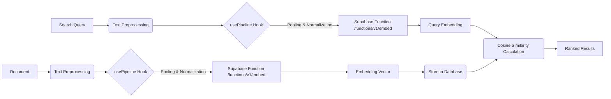

# Embedding Generation Process

This document outlines the process of generating embeddings for documents, which is a crucial component for enabling semantic search within the application. It details the model used, the parameters involved, and the role of the Supabase function responsible for embedding generation.

**Target Audience:** Backend Developers, Data Scientists

## Semantic Search

Semantic search aims to understand the *meaning* behind search queries and documents, rather than simply matching keywords. This allows users to find relevant information even if the exact words they use don't appear in the documents themselves.  Our application leverages embeddings to achieve this.

The core idea is to represent both search queries and documents as vectors in a high-dimensional space.  The closer two vectors are in this space, the more semantically similar the corresponding query and document are.  We use cosine similarity to measure the distance between these vectors.

## Embedding Generation

The process of generating these vector representations (embeddings) involves several key steps:

1.  **Model Selection:** We utilize the `Supabase/gte-small` model for generating embeddings. This model is a transformer-based model specifically designed for generating high-quality text embeddings. It's a relatively small model, making it efficient for our use case.

2.  **Text Preprocessing:** Before feeding the text to the model, we perform basic preprocessing steps such as:
    *   Lowercasing
    *   Removing punctuation
    *   Tokenization (splitting the text into individual words or sub-words)

3.  **`usePipeline` Hook and Parameters:**  The `usePipeline` hook (likely a custom hook within the application's frontend or a similar service) is used to interact with the embedding model.  Crucially, it configures the model's behavior through parameters related to pooling and normalization.

    *   **Pooling:** Pooling refers to the strategy used to combine the embeddings of individual tokens into a single embedding for the entire document. Common pooling strategies include:
        *   **Mean Pooling:**  Averages the embeddings of all tokens.
        *   **Max Pooling:**  Takes the maximum value for each dimension across all token embeddings.
        *   **CLS Pooling:** Uses the embedding of the special `[CLS]` token (present in many transformer models) as the document embedding.

        The specific pooling strategy used significantly impacts the quality of the embeddings.  The choice depends on the characteristics of the text data and the desired semantic properties.

    *   **Normalization:** Normalization ensures that all embeddings have a similar scale. This is important for cosine similarity, as it is sensitive to the magnitude of the vectors.  We apply L2 normalization, which scales each vector to have a unit length.

    ```javascript
    // Example (Conceptual) of how the usePipeline hook might be used
    const { data: embeddings, isLoading, error } = usePipeline(
      'feature-extraction', // Task type
      'Supabase/gte-small', // Model name
      {
        pooling: 'mean', // Example pooling strategy
        normalize: true, // Enable L2 normalization
      }
    );
    ```

4.  **Supabase Function (`/functions/v1/embed`):** The core embedding generation logic is encapsulated within a Supabase function located at `/functions/v1/embed`. This function receives the preprocessed text as input and returns the corresponding embedding vector.

    The function likely performs the following steps:

    *   Receives the text from the client.
    *   Loads the `Supabase/gte-small` model.
    *   Applies the specified pooling and normalization techniques.
    *   Generates the embedding vector using the model.
    *   Returns the embedding vector to the client.

    **Example Request to `/functions/v1/embed`:**

    ```json
    {
      "text": "This is an example document that needs to be embedded."
    }
    ```

    **Example Response from `/functions/v1/embed`:**

    ```json
    {
      "embedding": [
        0.123,
        -0.456,
        0.789,
        ...,
        -0.987
      ]
    }
    ```

    The OpenAPI specification provided does not include the `/functions/v1/embed` endpoint.  Therefore, the above examples are illustrative.

5.  **Storing Embeddings:** Once generated, the embeddings are stored in a database (likely Supabase) alongside the original documents. This allows for efficient retrieval and comparison during semantic search.

## Using Embeddings for Semantic Search

When a user performs a search, the following steps occur:

1.  **Generate Embedding for the Query:** The search query is passed to the `/functions/v1/embed` function to generate its embedding vector.

2.  **Calculate Cosine Similarity:** The embedding of the search query is compared to the embeddings of all documents in the database using cosine similarity.  Cosine similarity measures the angle between two vectors, with a value of 1 indicating perfect similarity and a value of -1 indicating perfect dissimilarity.

    ```python
    import numpy as np
    from numpy.linalg import norm

    def cosine_similarity(a, b):
      return np.dot(a, b)/(norm(a)*norm(b))

    # Example usage (assuming embeddings are numpy arrays)
    query_embedding = np.array([0.1, 0.2, 0.3])
    document_embedding = np.array([0.4, 0.5, 0.6])

    similarity = cosine_similarity(query_embedding, document_embedding)
    print(f"Cosine Similarity: {similarity}")
    ```

3.  **Rank and Retrieve Results:** The documents are ranked based on their cosine similarity scores. The documents with the highest scores are considered the most semantically relevant and are returned to the user.

## Conceptual Diagram



## Optimizing Embedding Generation

Several factors can influence the performance and accuracy of the embedding generation process:

*   **Model Choice:**  Experiment with different embedding models to find the one that best suits the specific characteristics of your data.  Consider factors such as model size, training data, and supported languages.
*   **Pooling Strategy:**  Evaluate different pooling strategies to determine which one yields the most semantically meaningful embeddings for your use case.
*   **Normalization:**  Ensure that embeddings are properly normalized to improve the accuracy of cosine similarity calculations.
*   **Text Preprocessing:**  Fine-tune the text preprocessing steps to remove noise and improve the quality of the input text.
*   **Hardware Acceleration:**  Utilize GPUs to accelerate the embedding generation process, especially when dealing with large volumes of text.
*   **Caching:** Cache generated embeddings to avoid redundant computations.

By carefully considering these factors, you can optimize the embedding generation process and improve the performance of your semantic search application.
